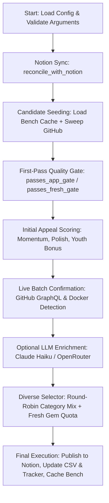

# Notion50 Runner Analysis: v11 Model Usage & Workflow Report

This report provides a comprehensive breakdown of the AI models employed by `run_next_set_v11.py`, documents the structural dependency on `run_next_set.py`, and outlines the end-to-end execution pipeline of the Notion50 runner.

---

## 1. AI Model Usage & Enrichment Mechanics

The `run_next_set_v11.py` runner features an optional **LLM Enrichment** phase (triggered by the `--enrich` flag) to refine repository classification, verify self-hostability, generate human-readable hooks, and gauge project novelty.

### Employed AI Models

| Model Provider | Model Name | Configuration Variables | Purpose |
| :--- | :--- | :--- | :--- |
| **Anthropic** | `claude-haiku-4-5` | `ANTHROPIC_MODEL = "claude-haiku-4-5"`<br>`ANTHROPIC_VERSION = "2023-06-01"` | **Primary LLM** used for high-accuracy JSON-schema classification. |
| **OpenRouter** | `nvidia/nemotron-3-ultra-550b-a55b:free` | `OPENROUTER_MODEL = "nvidia/nemotron-3-ultra-550b-a55b:free"` | **Fallback LLM** used when Anthropic API credentials are not found. |

### API Key Resolution & Authentication
The runner looks up API keys in memory (without exposing them on the command-line/argv for security):
1. **Anthropic Key Lookup**: Checks the `ANTHROPIC_API_KEY` environment variable first, falling back to `~/.config/anthropic/api_key`.
2. **OpenRouter Key Lookup**: Checks the `OPENROUTER_API_KEY` environment variable first, falling back to `~/.config/openrouter/api_key`.

### LLM Enrichment Functionality & Rules
When `--enrich` is enabled, the runner batch-sends candidate repositories (in groups of 15) to the chosen LLM. The LLM is instructed to return a structured JSON array containing:
* `category`: The single best-fit category from the pre-defined list.
* `self_hostable` (Boolean): Identifies whether the project is a deployable app/service rather than a library or extension.
* `reject_reason`: A short explanation (≤8 words) if `self_hostable` is false.
* `interest_hook`: A short, concrete hook (≤15 words) explaining why someone would self-host this.
* `novelty` (Integer 1-5): Rating representing the rarity/novelty of the project.

> [!NOTE]
> **Docker + Awesome Bypass (Optimization)**:
> Finalists that are already verified in the `awesome-selfhosted-data` index **AND** have detected Docker configurations bypass the LLM phase completely. They are labeled as `{"source": "bypass"}`. This optimization reduces API usage and eliminates fabricated text for projects that are guaranteed to be self-hostable.

### Scoring Adjustment
* **Non-Selfhostable Penalty**: Repositories flagged by the LLM as not self-hostable receive a severe penalty of **`-15.0`** points (`ENRICH_SELFHOST_PENALTY`), which filters them out of selection.
* **Novelty Adjustment**: The appeal score is adjusted based on the LLM-reported novelty (`novelty - 3`). Higher-novelty projects (rating 4 or 5) get a boost, while generic ones (rating 1 or 2) are dampened.

---

## 2. Dependency Analysis: `run_next_set_v11.py` vs. `run_next_set.py`

There is a direct, active dependency between the two scripts. `run_next_set.py` is **not just a reference file**; it acts as the stable plumbing library for `run_next_set_v11.py`.

At line 47, `run_next_set_v11.py` imports `run_next_set` as a module:
```python
import run_next_set as v1
```

### Shared Functions and State Inherited from `v1` (`run_next_set.py`):
1. **Directory and File Paths**:
   - `v1.TRACKER`: Points to the master tracker JSON (`notion-selfhosted-tracker.json`).
   - `v1.AUDIT_DIR`: Points to the audit outputs directory (`_tmp`).
   - `v1.MASTER_CSV`: Points to the live master CSV file (`notion-selfhosted-master.csv`).
   - `v1.MASTER_CSV_HEADER`: Header schema for the master CSV.
2. **Notion Core Auth & SDK Handlers**:
   - `v1.load_notion_key()`: Loads Notion API credentials from env or config files.
   - `v1.notion_request(method, endpoint, payload)`: Sends HTTP requests to the Notion API.
   - `v1.append_blocks(page_id, blocks)`: Appends rich text blocks to Notion.
   - `v1.rt(text, ...)`: Helper to construct Notion-compatible rich text payloads.
   - `v1.notion_url(title, page_id)`: Generates clickable Notion links.
3. **Reconciliation & State Syncing**:
   - `v1.reconcile_with_notion(tracker)`: Compares local state against live pages in Notion, extracts published repositories to rebuild the global deduplication database, and syncs both environments.
   - `v1.write_tracker(tracker)`: Atomic writer to persist tracker state.
4. **Basic API & Subprocess Execution**:
   - `v1.run(cmd)`: Subprocess shell command runner.
   - `v1.canonical_repo(url)`: Resolves redirect URLs to their canonical GitHub repositories and drops archived, disabled, or forked projects.

---

## 3. High-Level Workflow: How the Runner Works

The execution flow of `run_next_set_v11.py` can be summarized into the following main phases:



### End-to-End Workflow Breakdown

* **Phase 1: Synchronization & Safety**
  * Parses arguments (e.g. `--dry-run`, `--enrich`, `--fresh-quota`).
  * Reconciles local `notion-selfhosted-tracker.json` with Notion live workspace data via GraphQL/REST, gathering all previously-published repository URLs to build a strict, global de-duplication database.
  * Verifies that the new set's title does not conflict with existing Notion page titles.

* **Phase 2: Bounded Benched Discovery**
  * Seeds the search pool using the **Bench Cache** (`_tmp/bench_v11.json`, 14-day TTL), which stores scored-but-unselected candidates from the previous run. This reduces GitHub search queries from ~132 to ~10–25 per run.
  * Rotates and executes GitHub API searches for any deficit. Runs a "Quality Sweep" (stars >= 8) and a "Fresh-Gem Sweep" (stars >= 1).
  * Implements early-exit triggers and maintains a hard cap of 60 search requests to avoid secondary GitHub rate limits.

* **Phase 3: Gating & Appeal Scoring**
  * Filters out non-app types (awesome-lists, templates, libraries, browsers extensions, mobile clients).
  * Uses `passes_app_gate` for standard repos, and a gentler `passes_fresh_gate` for new or low-star repos.
  * Scores remaining repositories using a multi-factor formula:
    * **Momentum**: Star growth relative to age.
    * **Liveliness**: Time since last commit/push.
    * **Traction**: Total star count.
    * **Polish**: Description length, homepage URL presence, valid license, and topics.
    * **Self-Host Signal**: Presence of good topics.
    * **Youth Bonus**: Extra points for newly created repositories (< 1 year old).
    * **Gem Balance**: Graduated curve that dampens mega-repos, boosts middle-tier, and gently handles low-star fresh projects instead of crushing them with flat penalties.

* **Phase 4: Live Confirmation & Docker Checking**
  * Shortlists the top ~130 candidate repositories (round-robin by category).
  * Confirms that each repository is live and not forked/archived/disabled using batched GitHub GraphQL API calls (up to 35 repos per request).
  * Feature-detects Docker support by checking for files like `docker-compose.yml`, `compose.yaml`, `Dockerfile`, or `.env.example` directly in the root directory.

* **Phase 5: Optional LLM Enrichment**
  * If `--enrich` is set, queries the LLM (`claude-haiku-4-5` or fallback) to categorize repositories, verify self-host status, and assign novelty rankings.
  * Docker + Awesome-listed items skip this step.

* **Phase 6: Selection & Quota Matching**
  * Groups candidates by their heuristic category.
  * Performs balanced category diversity selection (Phase 1: seeds one per category; Phase 2: fills to 50 under category caps, relaxing caps iteratively).
  * Enforces the **Fresh-Gem Quota** (default: 10). If the selection contains fewer than 10 fresh gems, it swaps out the lowest-scoring non-fresh picks for high-scoring fresh candidates (while preserving category diversity).

* **Phase 7: Publication & Bench Archiving**
  * Creates the child page in Notion and appends the 50 formatted blocks, complete with rich text and badges (`🐳` Docker, `⭐` Awesome-listed, `✨` Fresh Gem).
  * Appends the 50 selected items to the `notion-selfhosted-master.csv`.
  * Writes a detailed JSON audit log.
  * Saves the unused vetted candidates back to `_tmp/bench_v11.json` as the seed bench for the next run.
